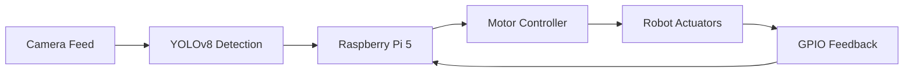

  

  
 
  

  

---

## 🚀 About Me

I am an AI & Data Science Engineer specializing in machine learning, deep learning, computer vision, NLP, and data analytics, with a focus on developing intelligent, scalable, and impactful AI solutions. With a solid academic foundation in Artificial Intelligence & Data Science, my engineering philosophy revolves around building production-grade, highly optimized software architectures that seamlessly interface with hardware. From deploying custom multi-modal computer vision networks on resource-constrained edge devices to architecting predictive data analytics pipelines, I specialize in transforming theoretical AI paradigms into rugged, physical deployments.

*   **🎓 Education:** B.Tech in Artificial Intelligence and Data Science @ Jyothi Engineering College
*   **💡 Philosophy:** "Hardware without software is a corpse; software without hardware is a ghost. Intelligence is what animates both."
*   **🎯 Specializations:** Computer Vision, Edge AI Deployment, Autonomous Robotics, NLP Architecture

---

## 🏆 Publications & Strategic Achievements

### 📝 Peer-Reviewed Research Publications
*   **IEEE International Conference (ICE2CPT2025):** Published *"Personal Companion Robot - Smart Buddy"* focusing on real-time computer vision optimization and LLM edge APIs.
*   **International Conference on AI-Driven Solutions (ADSSSC 2026):** Published *"AI-Based Coconut Tree Climbing and Harvesting Robot"* detailing state-of-the-art edge execution of deep object detectors for agricultural precision automation.

### 🥇 Competitive Milestones & Ecosystem Contributions
*   **NASA Space Apps Challenge (2024 & 2025):** Competed in 48-hour high-intensity hackathons engineering data models focused on Sustainable Development Goals (SDGs), climate modeling, and predictive ecosystem metrics.
*   **National Service Scheme (Unit 140):** Contributed 90+ hours of community-focused engineering and organizational volunteer leadership.

---

## 💼 Featured Production-Grade Projects

### 🤖 AI-Based Autonomous Harvesting Robot
> **Core Focus:** Deep Learning Object Detection, Edge Computing, Embedded Systems Architecture

*   **Business Problem:** Mitigating acute labor shortages in precision tropical agriculture through high-performance, safe, autonomous machinery.
*   **Architecture:** Camera Sensor Capture $\rightarrow$ Local Frame Buffer $\rightarrow$ Quantized Edge YOLOv8 Processing $\rightarrow$ Low-latency GPIO Motor Commands $\rightarrow$ Multi-sensor Feedback Control Loops.
*   **Tech Stack:** `Python`, `YOLOv8`, `PyTorch`, `Raspberry Pi 5`, `Ultrasonic Sensor Arrays`, `DC/Stepper Hardware Motor Controllers`.
*   **Engineering Highlights:** Formulated and curated a highly specialized dataset containing 1,200+ meticulously annotated target images. Trained and cross-validated custom object detection networks to secure an elite **88.4% mAP** rating. Engineered custom hardware abstractions on Python to coordinate live vision data pipelines with real-time hardware actuator triggers.

### 🧸 Smart Buddy: Interactive LLM Companion Node
> **Core Focus:** Multi-modal AI, Real-time Computer Vision, Voice-to-Text Pipelines, Edge Computing

*   **Business Problem:** Creating latency-optimized, highly responsive companion interfaces that smoothly combine environmental tracking with conversational intelligence.
*   **Architecture:** Dual-Threaded Processing Engine: Thread A manages camera input, face/human bounding-box calculation, and adaptive tracking; Thread B pipelines audio capture, secure asynchronous API requests, and streaming voice synthesis.
*   **Tech Stack:** `Python`, `Gemini Pro API`, `OpenCV`, `Raspberry Pi 5`, `L298N Motor Architecture`, `Hardware Microphones/Speakers`.
*   **Engineering Highlights:** Implemented high-efficiency multi-threading architectures preventing I/O network blockages from halting the robot's physical motor controls. Built robust error-handling states around low-latency GPIO indicators to gracefully mitigate connection drops during live API routing.

---

### 📉 Predictive Stock Market Pipeline (LSTM Architecture)
> **Core Focus:** Sequential Deep Learning, Natural Language Processing, Real-Time Data Pipelines

*   **Architecture:** Live Exchange API Fetching $\rightarrow$ Multi-source Alternative Text Mining $\rightarrow$ Sentiment Tensor Projection $\rightarrow$ Multi-layered Long Short-Term Memory Network $\rightarrow$ Future Value Estimation.
*   **Tech Stack:** `Python`, `PyTorch`, `TensorFlow`, `scikit-learn`, `NLP Sentiment Toolchains`, `Financial Stream REST APIs`.
*   **Engineering Highlights:** Engineered a robust multi-layered sequence learning platform utilizing alternative sentiment data streams and historical trend lines. Reached an **85% validation accuracy** metric for directional price estimation over rolling 7-day windows.

---

### 🌧️ Pollution & Precipitation Analytical Engine
> **Core Focus:** Big Data Engineering, Environmental Informatics, Predictive Analytics

*   **Architecture:** Chronological REST API Harvesting $\rightarrow$ Feature Engineering Pipeline ($PM_{2.5}, PM_{10}, NO_2, SO_2$) $\rightarrow$ Multi-variate Regression Systems $\rightarrow$ Web Client Dashboard Visualization.
*   **Tech Stack:** `Python`, `SQL`, `Tableau Data Engines`, `Real-Time Atmospheric REST APIs`.
*   **Engineering Highlights:** Developed a clean, analytical platform processing live environmental data matrices into precise, 24-hour predictive local weather and pollutant models.

---

## ⚡ Engineering Tech Stack

<table width="100%">
  <tr>
    <td width="50%" valign="top">
      <h3>💻 Core Programming & Data Math</h3>
      
      
      
    </td>
    <td width="50%" valign="top">
      <h3>🧠 Intelligence & Deep Learning</h3>
      
      
      
      
    </td>
  </tr>
  <tr>
    <td width="50%" valign="top">
      <h3>⚙️ Robotics & Physical Systems</h3>
      
      
      
      
    </td>
    <td width="50%" valign="top">
      <h3>📊 Systems Automation & MLOps</h3>
      
      
      
      
    </td>
  </tr>
</table>

---

## 🏗️ Technical Credentials & Verifications
*   **IIT Kharagpur (NPTEL):** Introduction to Machine Learning — Evaluated Deep Regression models, SVMs, and neural topologies. (Score: 66% | 24.58/25 Coursework assignments).
*   **ICT Academy:** Natural Language Processing (NLP) Intern Certification — Focused on recurrent networks, state structures, and sequence modelling.
*   **Jyothi Engineering College:** Advanced AI/ML Portfolio Training Program.
*   **Infosys Springboard:** Data Science Foundation Professional Credential.
*   **Infosys Springboard:** Applied Generative AI Professional Architecture Certification.

---

## 📈 Git Activity

  

  <picture>
    <source
      media="(prefers-color-scheme: dark)"
      srcset="https://raw.githubusercontent.com/amalkrishnam7/amalkrishnam7/output/github-contribution-grid-snake-dark.svg">
    <source
      media="(prefers-color-scheme: light)"
      srcset="https://raw.githubusercontent.com/amalkrishnam7/amalkrishnam7/output/github-contribution-grid-snake.svg">
    
  </picture>

---

## 🌱 Currently Vectorizing Research Into
*   **Agentic AI Infrastructure:** Designing self-correcting workflow systems built via `N8N` integration nodes and localized small language models.
*   **Edge Vision Optimization:** Profiling custom TensorRT layer engine optimization paths to maximize inference speeds on micro-processing arrays.
*   **Advanced Mechatronics & Control Systems:** Integrating real-time state space feedback vectors into physical edge robotic assemblies.

---

## 🤝 Establish Contact Matrix

  
  &nbsp;
  
  &nbsp;
  

 

  "The best way to predict the future is to build the algorithms that compute it, and the systems that execute it." ⚡

